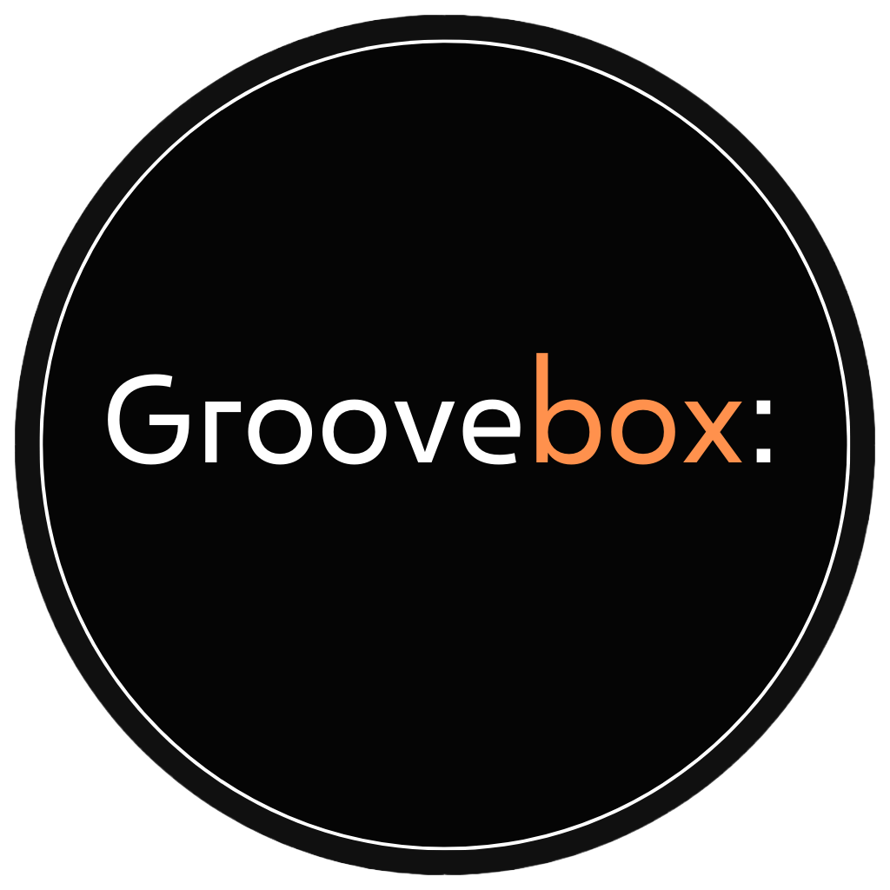

# GrooveBox

GrooveBox es una plataforma web que ofrece a los distintos DJ's poder publicar y usar mezclas, siendo estas tanto como producto final o como pista para producir nuevas mezclas, facilitando a los artistas inspiración y la búsqueda de pistas perfectas para sus sesiones de música.

GrooveBox is a web plataform that allows to DJ's publish and use mixes, both as a final product or as a track to produce new mixes, making easier for artists to find inspiration and the perfect tracks for their music sessions.