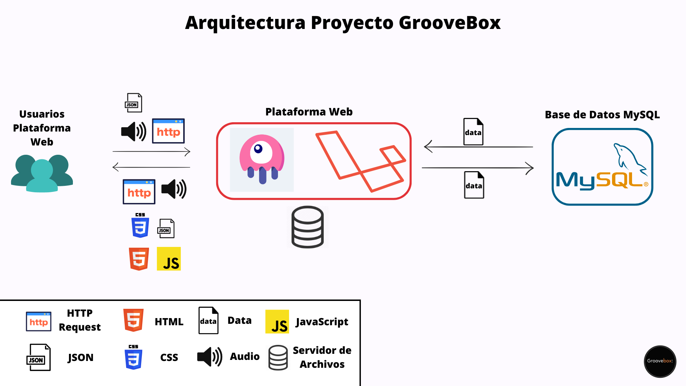

  # Anteproyecto - GrooveBox

  

    
  

  
  ## Índice

  - [Descripción del problema](#descripción-del-problema)
  - [Objetivo](#objetivo)
  - [Arquitectura y tecnologías a utilizar](#arquitectura-y-tecnologías-a-utilizar)
  - [Boceto de la solución](#boceto-de-la-solución)
  
  ### Descripción del problema.

   A día de hoy los DJ's producen mezclas con música de artistas conocidos mundialmente, con mezclas que crean ellos mismos o mezclas pre-producidas por ellos mismos u otros DJ's. En el caso de las mezclas pre-producidas, los DJ's se encuentran en el dilema de poder encontrar esas mezclas y que además tengan una buena calidad.

  ### Objetivo.

  GrooveBox ofrece la posibilidad a los DJ's una plataforma en la que poder publicar sus mezclas para almacenarlas y ofrecerlas a otros DJ's para que puedan utilizar estas como recursos musicales de una manera cómoda.

  
  ### Arquitectura y tecnologías a utilizar.
  
  GrooveBox se constará de cuatro servicios. Un servicio para la plataforma web desarrollada en Laravel junto al framework Livewire, que consume de un Servidor de Base de Datos MYSQL. Los servicios sería desplegado con Nginx.

  #### Tecnologías
  
  - Nginx
  - Livewire
  - Laravel (PHP)
  - MySQL Server

  #### Boceto de la solución

  

  
  

  

