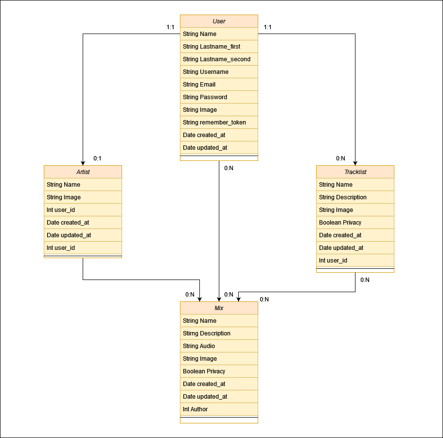

# Clases

Aquí podrás ver las clases (modelos) de GrooveBox.

## Índice
- [Diagrama Entidad-Relación](#diagrama)
- [Documentación del diagrama](#documentación-del-diagrama)
  - [Relaciones](#relaciones)

## Diagrama

## Documentación del Diagrama

### Relaciones

| Clase 1   | Clase 2   | Relación                                                                                                 |
|-----------|-----------|----------------------------------------------------------------------------------------------------------|
| Usuario   | Artista   | Un Usuario tiene un solo perfil de Artista y un perfil de Artista solo pertenece a un único Usuario      |
| Usuario   | Tracklist | Un Usuario puede tener 0 o más Tracklists, y una Tracklist solo puede pertenecer a un Usuario            |
| Usuario   | Mezcla    | Un Usuario le pueden gustar 0 o más mezclas, y una mezcla puede ser gustada por 0 o más Usuarios         |
| Tracklist | Mezcla    | Una Tracklist puede tener 0 o más Mezclas, mientras que una Mezcla puede pertenecer a 0 o más Tracklists |
| Artista   | Mezcla    | Un artista puede producir 0 o más Mezclas, y las Mezclas solo pertenecen a un único Artista.             |

